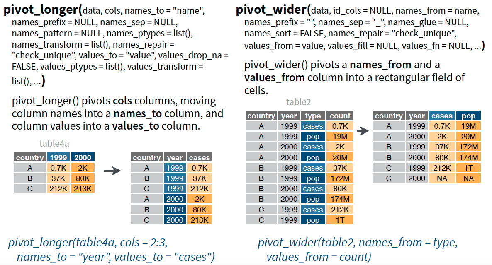
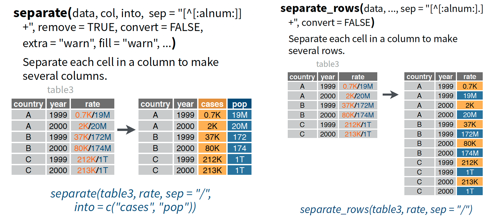
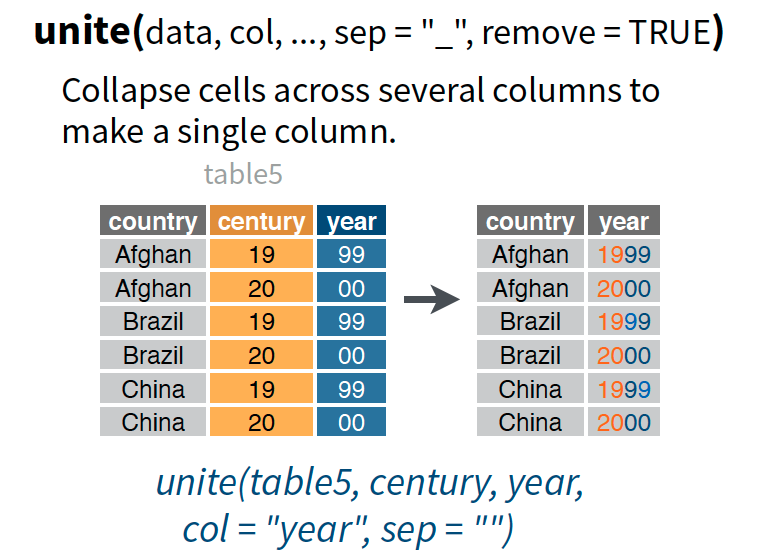
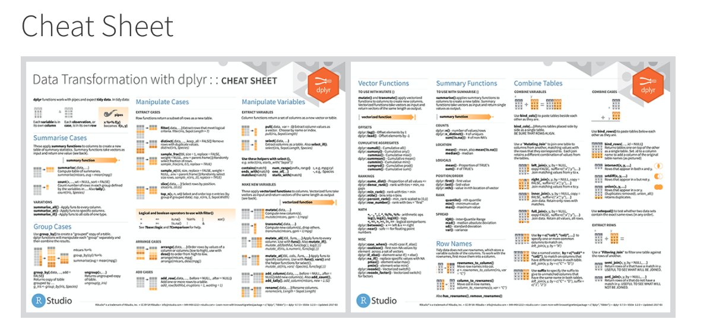

```{r setup, include=FALSE}
knitr::opts_chunk$set(echo = FALSE)
library(tidyverse)
#knitr::opts_chunk$set(tidy=TRUE)
data <- read_csv("data_sim.csv")
```

## What is tidy data?

-   A way to organize your data that is consistent across datasets

-   Each variable is a column, observation is a row, and cell is a value


> "Tidy datasets are all alike, but every messy dataset is messy in its own way." -- Hadley Wickham

## What is tidyverse?

There are several ways to wrangle your data into a tidy format, but ***tidyverse*** has some great/easy functions.

The ***tidyverse*** is a coherent system of packages for data manipulation, exploration and visualization.

Includes:

-   ggplot2 - graphics and plots

-   dplyr - data manipulation

-   tidyr - to create tidy data format

-   & others

## My favorite dplyr functions

### Filter

-   Use ***filter*** to include only observations that meet a specific criteria.
-   For example, if I want a dataset consisting only of females, or only of those individuals with depression above the average depression score in this sample.
-   This is useful when your data contains many waves/arms.

```{r dplyr filter 1, echo = T, eval = T}
data_female <- filter(data, sex == "Female")
data_above_average <- filter(data, depression_1 >
                      mean(depression_1, na.rm = T))
```

## My favorite dplyr functions

### Filter

```{r dplyr filter 2, echo = T, eval = T}
head(data_female[,c(1,2,4)])
```

## My favorite dplyr functions

### Filter

```{r dplyr filter 3, echo = T, eval = T}
mean(data$depression_1, na.rm = T)
head(data_above_average[,c(1,2,4,9)])
```

## My favorite dplyr functions

### Select

-   Use ***select*** to include only the variables of interest
-   For example, in subset 1 if I wanted data that only contains "age, sex, anxiety and early life stress" variables
-   Or, use a selection helper like ***contains***, to subset data with all variables that contain the string "depression"
-   Other helpers include ***starts\_with***, ***ends\_with***, and ***matches***
-   This is useful when subsetting and scoring individual measures that are named with a convention (e.g. bdi\_1, bdi\_2, etc.)

```{r dplyr select 1, echo = T, eval = T}
data_subset_1 <- select(data, participant, 
                age, sex, anxiety, early_life_stress)
data_subset_2 <- select(data, participant, 
                contains('depression'))
```

## My favorite dplyr functions

### Select

```{r dplyr select 2, echo = T, eval = T}
head(data_subset_1)
```

## My favorite dplyr functions

### Select

```{r dplyr select 3, echo = T, eval = T}
head(data_subset_2)
```

## My favorite dplyr functions

### Mutate

-   Use mutate to add new variables while preserving existing ones

```{r dplyr mutate, echo = T, eval = T}
data_new <- mutate(data, 
            anxiety_norm = 
            anxiety / mean(anxiety)) 
head(data_new[,c(1,2,6,12)])
```

## BONUS

### Normal Syntax

-   Can be difficult to read when things get complicated (focus on nouns, must read from inside out).

```{r pipe 1, echo = T, eval = F}
data_new <- mutate(data, 
            anxiety_norm = 
            anxiety / mean(anxiety)) 
```

-   In an object called data\_new, mutate a variable using data.

### Pipe Operator (technically from magrittr package)

```{r pipe 2, echo = T, eval = F}
data_new <- data %>%
            mutate(anxiety_norm = 
            anxiety / mean(anxiety)) 
```

-   Focuses on verbs, easier to read
-   In an object called data\_new, take my data and then mutate it.
-   Can be used with all functions

## My favorite tidyr functions

### Pivot

-   Convert data from long to wide format and vice versa



## My favorite tidyr functions

### Separate



## My favorite tidyr functions

### Unite



## Cheatsheets and More

- Find cheatsheets and more for each package at: https://tidyverse.tidyverse.org/


- Now for a data cleaning tutorial!